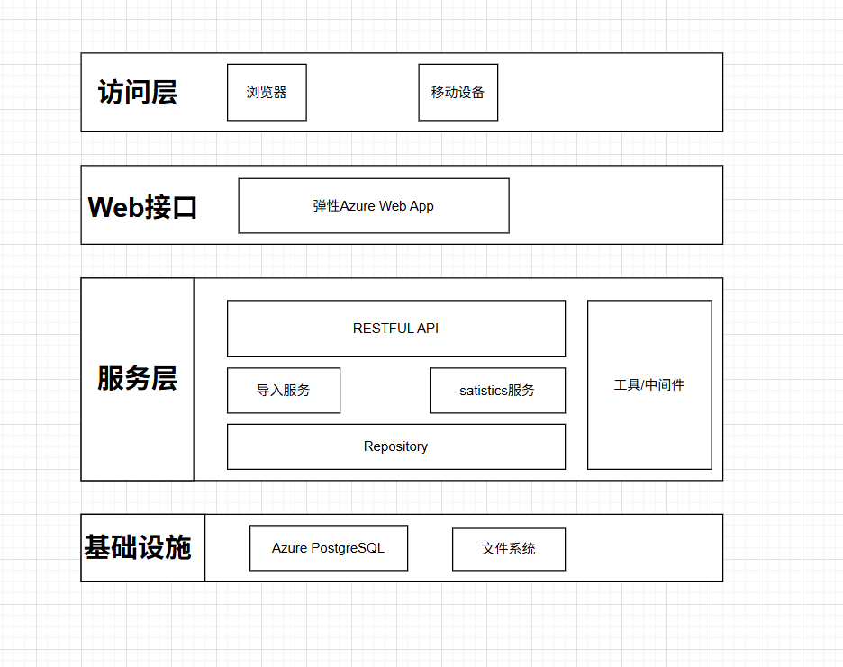
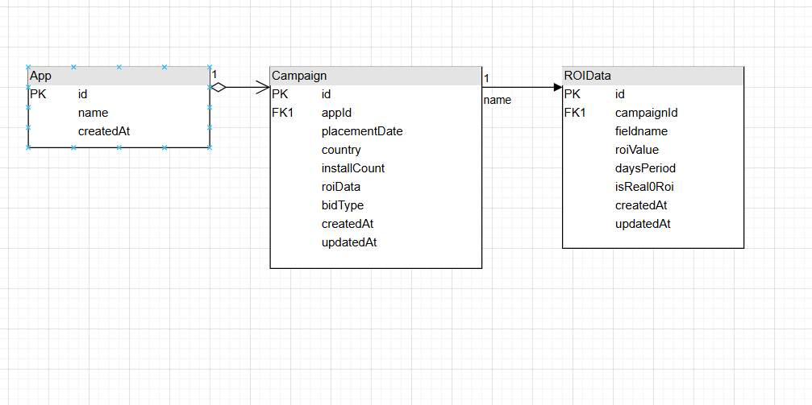
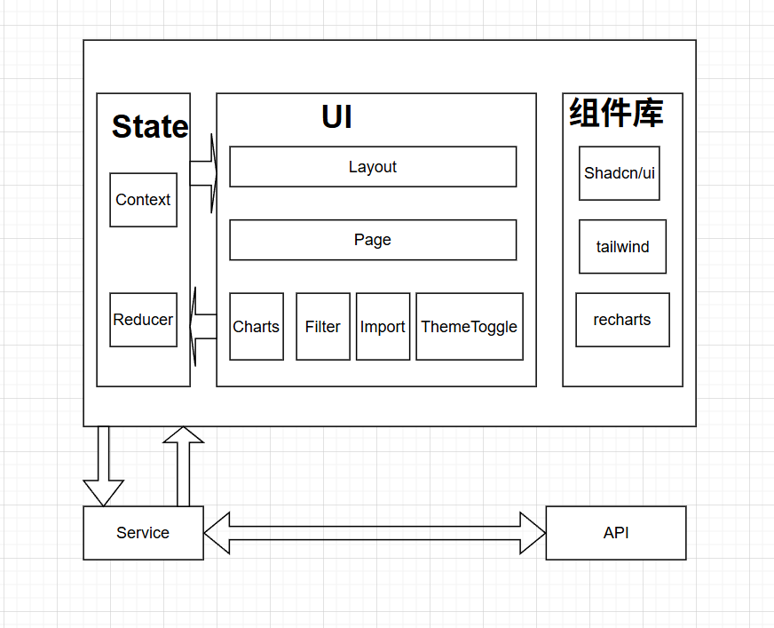
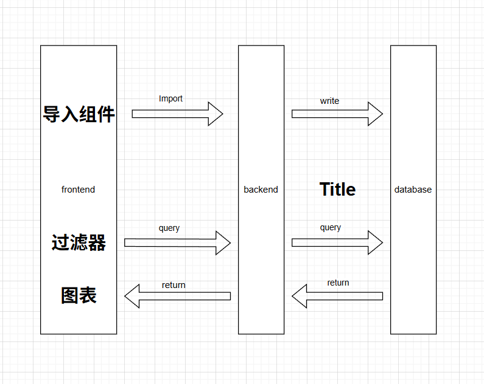

# 广告ROI数据分析系统设计文档

## 系统架构


## 数据库表设计


## API接口设计规范
1. 状态检查
```
{
    method: 'get',
    endpoint: '/health',
    response: {
        status: string;
        timestamp: string;
        environment: 'production' | 'development' | string;
    }
}
```
2. 导入CSV
```
{
    method: 'post',
    endpoint: '/api/roifiles/import',
    request: {
        file: 'multipart/form-data'        
    }
}
```
3. 验证CSV
```
{
    method: 'post',
    endpoint: '/api/roifiles/import',
    request: {
        file: 'multipart/form-data'        
    },
    response: {
        success: boolean;
        message: string;
        errors: string[];
    }
}
```
4. 下载CSV模板
```
{
    method: 'get',
    endpoint: '/api/roifiles/template',
    request-body: {
        file: 'multipart/form-data'        
    },
    response: {
        'content-type': 'text/csv',
        'Content-Disposition': 'attachment; filename="roi_data_template.csv"'
    }
}
```
5. 查询统计
```
{
    method: 'get',
    endpoint: '/api/satistics',
    request-query: {
        appName: string;
        bidType: string;
        country: string;
    },
    response: {
        data: {
            placementDate: string;
            appName: string;
            country: string;
            bidType: string;
            installCount: number;
            roi: {
                day0?: {
                    value: number;
                    isReal0Roi: bool;
                } as RoiData;
                day1?: RoiData;
                day3?: RoiData;
                day7?: RoiData;
                day14?: RoiData;
                day30?: RoiData;
                day60?: RoiData;
                day90?: RoiData;
            }[]
        }[]
    }
}
```
6. 获取filters枚举项
```
{
    method: 'get',
    endpoint: '/api/satistics/filters',
    request: {
        file: 'multipart/form-data'        
    }
}
```

## 前端组件层次结构


## 数据流向图


